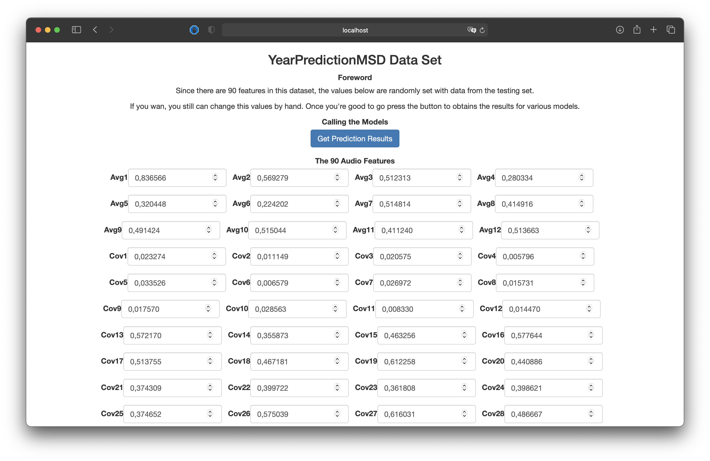
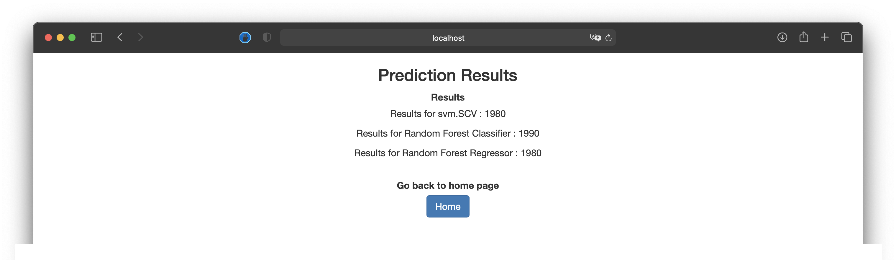

# YearPredictionMSD Data Set 
## Python for data analysis

* Théophile PUISEUX
* Nieves RODRIGUEZ ALVAR

## Projet goal
The Million Song Dataset (MSD) is a freely-available collection of audio features and metadata for a million contemporary popular music tracks. 
The purpose being to predict the release year of a song from audio features.

Songs in the dataset are mostly western, commercial tracks ranging from 1922 to 2011, with a peak in the year 2000s.

Due to the large spectrum of possible values (89 years), we decide that it was better to predict the decade of the release year. We thus did a classification.

## Dataset description
There are 90 attributes :
* TimbreAverage[1-12]
* TimbreCovariance[1-78]
These features were extracted from the 'timbre' features from The Echo Nest API. The authors took the average and covariance over all 'segments' and each segment was described by a 12-dimensional timbre vector.

## Machine Learning Models 
To predict the release decade of a song from audio feature, we used 4 different supervised classification machine learning models.

* Desicion Tree Classifier : Decision Trees (DTs) are a non-parametric supervised learning method used for classification and regression. Decision trees learn from data to approximate a sine curve with a set of if-then-else decision rules. The deeper the tree, the more complex the decision rules and the fitter the model. [Learn More Here](https://chiragsehra42.medium.com/decision-trees-explained-easily-28f23241248 "Learn More Here").

* Random Forest Classifier : A random forest is a meta estimator that fits a number of decision tree classifiers on various sub-samples of the dataset and uses averaging to improve the predictive accuracy and control over-fitting. The sub-sample size is controlled with the max_samples parameter if bootstrap=True (default), otherwise the whole dataset is used to build each tree. [Learn More Here](https://scikit-learn.org/stable/modules/generated/sklearn.ensemble.RandomForestClassifier.html "Learn More Here").

* Ridge Classifier : This classifier first converts the target values into {-1, 1} and then treats the problem as a regression task (multi-output regression in the multiclass case). [Learn More Here](https://scikit-learn.org/stable/modules/generated/sklearn.linear_model.RidgeClassifier.html "Learn More Here").

* SVC : C-Support Vector Classification. The implementation is based on libsvm. The fit time scales at least quadratically with the number of samples and may be impractical beyond tens of thousands of samples. For large datasets consider using LinearSVC or SGDClassifier instead, possibly after a Nystroem transformer. The multiclass support is handled according to a one-vs-one scheme. [Learn More Here](https://scikit-learn.org/stable/modules/generated/sklearn.svm.SVC.html "Learn More Here").

We then decided to do regression, considering the decade as a continuous value. We applied 4 different supervised regression machine learning models.

* Random Forest Regressor : A random forest is a meta estimator that fits a number of classifying decision trees on various sub-samples of the dataset and uses averaging to improve the predictive accuracy and control over-fitting. The sub-sample size is controlled with the max_samples parameter if bootstrap=True (default), otherwise the whole dataset is used to build each tree. [Learn More Here](https://scikit-learn.org/stable/modules/generated/sklearn.ensemble.RandomForestRegressor.html "Learn More Here").

* Linear Regression : LinearRegression fits a linear model with coefficients w = (w1, …, wp) to minimize the residual sum of squares between the observed targets in the dataset, and the targets predicted by the linear approximation. [Learn More Here](https://scikit-learn.org/stable/modules/generated/sklearn.linear_model.LinearRegression.html "Learn More Here").

* Lasso : Lasso regression is a type of linear regression that uses shrinkage. Shrinkage is where data values are shrunk towards a central point, like the mean. The lasso procedure encourages simple, sparse models (i.e. models with fewer parameters). [Learn More Here](https://www.statisticshowto.com/lasso-regression/ "Learn More Here").

* Elastic Net : Elastic net is a popular type of regularized linear regression that combines two popular penalties, specifically the L1 and L2 penalty functions. [Learn More Here](https://scikit-learn.org/stable/modules/generated/sklearn.linear_model.ElasticNet.html "Learn More Here").

## Web App
A web application was made using boostrap (frontend) and Flask (backend).

Due to the large spectrum of possible values (89 years) and the imbalanced data, we decide that it was better to predict the decade of the release year.

## Getting started
To use the web app :
* Clone the project (due to a size limitation, unzip the model that are compressed into archive.zip and the data in static/js folder)
* Start the flask API with "python app.py" (or "python3 app.py" according to your version of python)
* Go to [localhost:5000](http://localhost:5000 "localhost:5000") on your browser

API Main page : 

API Results page : 
